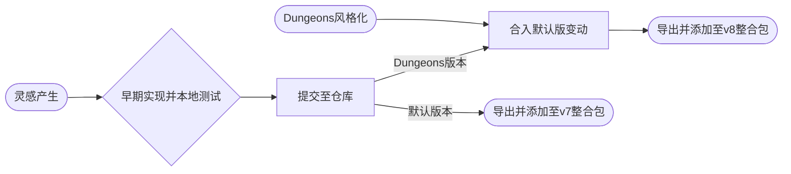

# 为SVC服务器整合包使用的标准资源包

由AllayJump工作室发起，全体玩家贡献。

## 为什么要创建它？

我们在开发SVC服务器的过程中，希望**修改一些原版的事物**————例如最初我们希望修改悦灵的材质，这就促成了SVCServer RescourcePack的第一代产生。它**最初基于基岩版**，因为那个时候还没有出现服务器整合包（~~而且我们也没有开发Java版资源包的经验😪~~）。

随着面向Java版的整合包的出现，我们在添加了服务器附加玩法所依赖的资源包外，还希望为整合包使用者提供**独一无二的SVC服务器体验**，因此开发此资源包便提上了日程。

最初的Java版资源包纯粹基于一个静态全景图的资源包，并修改了一个悦灵的材质。随着整合包的开发目标转变（基底客户端➡️精装修），我们逐步为这个资源包提供更多功能，例如翻译、游戏Title等，改进体验，成为**SVC服务器体验的重要组成部分**。

## 开发流程图

> 此流程并非一成不变，部分开发动作可同时进行。

## 任务清单

### 全局
- [ ] 全景图更新

### Dungeons独有
- [X] HUD实现Dungeons风格
- [ ] 方块材质覆盖Dungeons样式

 
## 修改的内容

此片段内容仅针对默认版本：

| 修改方向 | 修改内容 |
| --- | --- |
| 文本/翻译 | 针对文言、中文的附加玩法翻译修正补充、SplashText |
| 材质 | 针对特定生物的材质、全景图、主界面Title|
| 模型 | 无 |
| 音效 | 无 |
